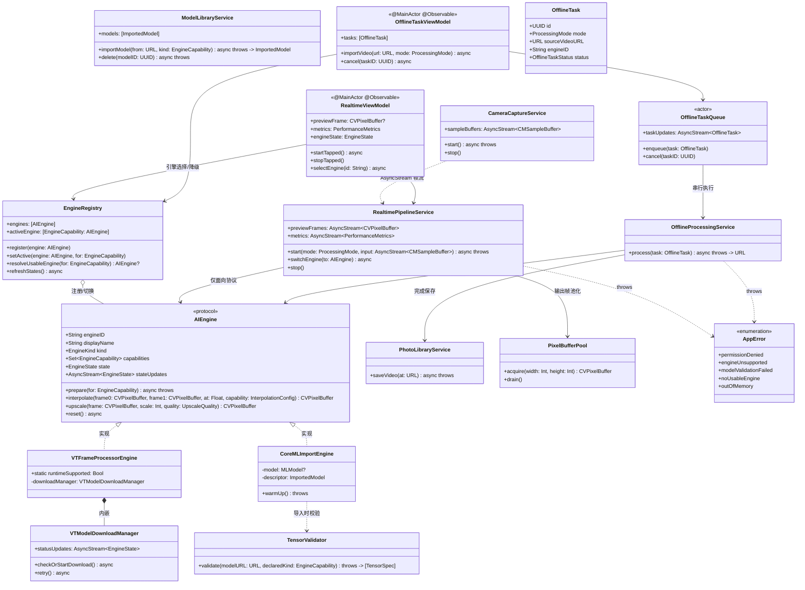
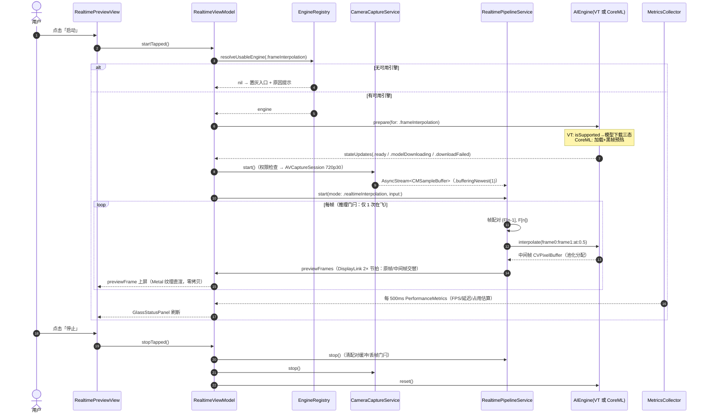
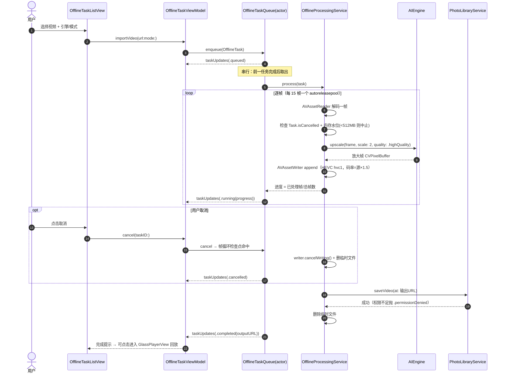

# VTFramePro 系统架构设计文档

- **版本**：v2.0 ｜ **作者**：架构师 高见远（Gao）
- **输入**：`docs/PRD_v2.md`（权威需求基准，Alice）
- **技术栈**：Swift 6 / SwiftUI（iOS 26 Liquid Glass）/ AVFoundation / VideoToolbox（VTFrameProcessor）/ CoreML / MetalPerformanceShaders / Photos
- **硬约束**：纯 iOS（不做 macOS）；部署目标 iOS 26，完整兼容 iOS 27；仅用 WWDC25/26 公开 API；**零第三方依赖**（无 FFmpeg、无私有 API、无 CocoaPods/SPM 外部包）；不内置任何模型

> ⚠️ **API 名称免责约定**：VTFrameProcessor 相关符号（类名、配置项、下载状态 API）均基于 WWDC25/26 公开资料推导，**最终以 Xcode 26 SDK 实际头文件为准**。文中所有不确定符号以 `※SDK` 标注，并给出 `#if canImport` / `@available` 兜底写法（见 3.3.4）。

---

## 1. 分层架构设计

### 1.1 五层结构与依赖方向

```
┌──────────────────────────────────────────────────────────────────────┐
│  L1  UI 层（SwiftUI 纯声明式，Liquid Glass）                            │
│  HomeView · RealtimePreviewView · OfflineTaskListView                │
│  ModelLibraryView · SettingsView · GlassPlayerView                   │
│  组件: GlassStatusPanel · EnginePicker · PermissionGuideView          │
│  ※ 禁止 import CoreML / VideoToolbox；只读状态、只发用户意图            │
└───────────────────────────────┬──────────────────────────────────────┘
                                │ @Observable 绑定 / 方法调用
┌───────────────────────────────▼──────────────────────────────────────┐
│  L2  ViewModel 层（@MainActor，业务编排）                              │
│  HomeViewModel · RealtimeViewModel · OfflineTaskViewModel            │
│  ModelLibraryViewModel · SettingsViewModel · GlassPlayerViewModel    │
│  ※ 唯一允许把"用户意图"翻译为"服务调用"的层；不直接碰引擎实现            │
└───────────────┬───────────────────────────────┬──────────────────────┘
                │                               │
┌───────────────▼───────────────────────────────┴──────────────────────┐
│  L3  媒体服务层（Media Services）                                     │
│  CameraCaptureService      — AVCaptureSession 720p 采集               │
│  RealtimePipelineService   — 实时帧流调度/丢帧/指标采集/预览帧输出        │
│  OfflineProcessingService  — AVAssetReader/Writer 离线处理 + 分批防OOM │
│  OfflineTaskQueue (actor)  — 严格串行任务队列、取消传播                 │
│  PhotoLibraryService       — PHPhotoLibrary 保存                      │
│  ModelLibraryService       — mlpackage 导入/校验/沙盒持久化/清单管理     │
│  PermissionService         — 权限查询与申请                            │
│  PixelBufferPool           — CVPixelBuffer 池化复用                   │
│  ※ 只依赖 L4 的 AIEngine 协议，不感知具体引擎类型                       │
└───────────────────────────────┬──────────────────────────────────────┘
                                │ 仅面向协议编程
┌───────────────────────────────▼──────────────────────────────────────┐
│  L4  AI 引擎协议层（Engine Abstraction）                               │
│  AIEngine (protocol)       — 补帧/超分统一抽象（见 §2.1）              │
│  EngineRegistry            — 引擎注册/能力查询/切换/降级决策            │
│  VTFrameProcessorEngine    — 系统引擎实现（iOS 26+，isSupported 检测） │
│  CoreMLImportEngine        — 用户导入 mlpackage 实现（CoreML + MPS）    │
│  TensorValidator           — 导入模型张量规格校验                      │
│  VTModelDownloadManager    — 系统 VT 模型下载三态管理                  │
└───────────────────────────────┬──────────────────────────────────────┘
                                │
┌───────────────────────────────▼──────────────────────────────────────┐
│  L5  Model 层（纯值类型 / 枚举 / 错误域，无框架依赖）                   │
│  ProcessingMode(5模式) · EngineCapability · EngineState · ModelKind  │
│  ImportedModel · TensorSpec · OfflineTask · PerformanceMetrics       │
│  ProcessingSettings · AppError                                       │
└──────────────────────────────────────────────────────────────────────┘
   系统框架: SwiftUI │ AVFoundation │ VideoToolbox │ CoreML │ MPS │ Photos
```

### 1.2 分层铁律

1. **依赖只允许自上而下**：L1→L2→L3→L4→L5，禁止反向引用、禁止跨层直达（UI 不直接调用推理，UI 不 import CoreML/VideoToolbox）。
2. **L3 只认识 `AIEngine` 协议**：实时/离线链路构造时由 `EngineRegistry` 注入具体引擎，链路代码中不出现 `VTFrameProcessorEngine` / `CoreMLImportEngine` 类型名。
3. **类型上送边界**：`CVPixelBuffer`/`CMSampleBuffer` 可上送至 L2（预览渲染需要）；`MLModel`/`MLMultiArray`/VT 会话对象**绝不允许离开 L4**。
4. **依赖注入**：所有 L3/L4 单例由 `AppDependencies` 构造注入，ViewModel 只依赖协议，便于单测 mock。
5. **UI 状态源**：ViewModel 使用 `@Observable` 宏（iOS 17+，iOS 26 全量可用），不使用 Combine `@Published`（见 §8.3 异步模型选型）。

---

## 2. AI 引擎协议抽象

### 2.1 协议定义草案（`AIEngines/AIEngine.swift`）

```swift
// MARK: - 能力枚举（L5 Models/EngineCapability.swift）
enum EngineCapability: String, CaseIterable, Sendable {
    case frameInterpolation   // 补帧
    case superResolution      // 超分
}

// MARK: - 引擎状态（L5 Models/EngineState.swift）
enum EngineState: Equatable, Sendable {
    case checking                          // 启动时能力检测中
    case ready                             // 可用
    case unsupported(reason: String)       // 硬件/系统不支持（入口置灰）
    case modelNotInstalled                 // CoreML 引擎：无已导入模型
    case modelDownloading(progress: Double)// VT 引擎：系统模型下载中
    case downloadFailed(message: String)   // VT 引擎：下载失败（可重试）
    var isUsable: Bool { self == .ready }
}

// MARK: - 统一引擎协议
/// 双引擎统一抽象。实时与离线链路只面向本协议编程。
protocol AIEngine: AnyObject, Sendable {
    /// 稳定标识（"system-vt" / 导入模型 UUID）
    var engineID: String { get }
    var displayName: String { get }        // UI 展示名
    var kind: EngineKind { get }           // .systemVT / .coreMLImported
    /// 声明的能力集（VT 引擎两者皆备；CoreML 引擎由导入时声明的用途决定）
    var capabilities: Set<EngineCapability> { get }
    /// 当前状态快照 + 状态流（下载进度等）
    var state: EngineState { get }
    var stateUpdates: AsyncStream<EngineState> { get }

    /// 能力检测/预热。VT: isSupported + 触发模型下载检查；CoreML: 加载并预热 MLModel。
    /// 幂等，可重复调用（如重试下载）。
    func prepare(for capability: EngineCapability) async throws

    /// 补帧：输入两帧 + 插值位置（0~1，默认 0.5），输出中间帧。
    /// 输出 buffer 由实现方从注入的 PixelBufferPool 分配。
    func interpolate(frame0: CVPixelBuffer,
                     frame1: CVPixelBuffer,
                     at timestep: Float,
                     capability capabilityConfig: InterpolationConfig) async throws -> CVPixelBuffer

    /// 超分：输入一帧，按 scale 放大输出（离线固定 x2；实时按档位）。
    func upscale(_ frame: CVPixelBuffer,
                 scale: Int,
                 quality qualityConfig: UpscaleQuality) async throws -> CVPixelBuffer

    /// 释放推理资源（链路停止/引擎被切走时调用）。
    func reset() async
}

enum EngineKind: Sendable { case systemVT, coreMLImported }
struct InterpolationConfig: Sendable { var factor: Int = 2 }        // 首版锁 x2（§10-1）
enum UpscaleQuality: Sendable { case lowLatency, highQuality }      // R-29 分档
```

### 2.2 错误类型（并入统一 `AppError`，引擎域单独编号段）

```swift
// Models/AppError.swift（节选引擎域）
enum AppError: LocalizedError, Sendable {
    // —— 引擎域 2xxx ——
    case engineUnsupported(detail: String)        // 2001 isSupported=false
    case modelDownloadFailed(underlying: String)  // 2002 VT 系统模型下载失败
    case modelValidationFailed(reasons: [String]) // 2003 张量校验失败（列全部原因）
    case noUsableEngine(capability: EngineCapability) // 2004 无任何可用引擎
    case inferenceFailed(underlying: String)      // 2005 推理执行失败
    // —— 权限 1xxx / IO 4xxx / 内存 4xxx 等见 §8.2 ——
}
```

### 2.3 引擎注册与切换机制（`AIEngines/EngineRegistry.swift`）

```swift
@Observable @MainActor
final class EngineRegistry {
    /// 全部已注册引擎：1 个 VTFrameProcessorEngine + N 个 CoreMLImportEngine（每模型一个实例描述）
    private(set) var engines: [any AIEngine] = []
    /// 当前生效引擎（每种能力各记录一个，供 R-20 切换）
    private(set) var activeEngine: [EngineCapability: any AIEngine] = [:]

    func register(_ engine: any AIEngine)                    // 启动时注册 VT；导入模型后注册 CoreML
    func unregister(engineID: String)                        // 删除模型时反注册
    func refreshStates() async                               // 启动/回前台时重跑 isSupported 检测
    func setActive(_ engine: any AIEngine,
                   for capability: EngineCapability) throws  // 校验 capabilities 包含该能力
    /// 降级决策（R-31）：
    func resolveUsableEngine(for capability: EngineCapability) -> (any AIEngine)?
    // 决策顺序：① 用户指定的 active 引擎且 state.isUsable → 用之
    //           ② VT 不可用 → 自动切到第一个 ready 的 CoreML 引擎（UI 横幅告知）
    //           ③ 均不可用 → 返回 nil，ViewModel 禁用入口并展示原因
}
```

**降级策略实现路径**：
- `HomeViewModel`/`RealtimeViewModel` 在进入页面前调用 `resolveUsableEngine`；返回 nil → 入口卡片置灰 + 原因文案（"设备不支持系统引擎，且未导入自定义模型"）。
- VT `state == .unsupported` → 该引擎相关默认选项自动摘除，UI 引导语"已切换至导入模型 XXX"；若检测到 VT 模型 `downloadFailed` → 展示重试按钮（重试策略见 §10-2）。
- 引擎热切换：运行中切换 → `RealtimePipelineService` 在下一帧边界调用旧引擎 `reset()`、新引擎 `prepare()`，预热完成前输出原始帧直通，避免黑屏/断帧。

### 2.4 双引擎实现要点

**VTFrameProcessorEngine**（`AIEngines/VTFrameProcessorEngine.swift`）：
- `prepare()` 内执行 `isSupported` ※SDK 类属性检测（时机：App 启动一次 + 回前台重检），false → `state = .unsupported`。
- 按链路分档创建 VT 会话配置：实时 = 低延迟配置（`VTLowLatency` 档 ※SDK），离线 = 高质量档（R-29）。
- 系统模型下载状态委托给 `VTModelDownloadManager`，把系统回调桥接为 `stateUpdates` 三态流。

**CoreMLImportEngine**（`AIEngines/CoreMLImportEngine.swift`）：
- 每个已导入并通过校验的模型对应一个引擎实例；`capabilities` 取自导入时声明用途（补帧/超分）。
- `MLModelConfiguration.computeUnits = .all`（ANE+GPU 自动调度）；`prepare()` 内懒加载 `MLModel` + 黑帧预热一次。
- 像素格式与张量转换用 MPS 在 GPU 完成（32BGRA ↔ RGB float），避免 CPU 逐像素转换。

---

## 3. 关键链路设计

### 3.1 实时链路（R-01/02/03，720p 上限，端到端 <150ms）

```
AVCaptureSession (preset .hd1280x720, 锁 30fps)
   │  AVCaptureVideoDataOutput，captureQueue（serial, .userInteractive）
   │  alwaysDiscardsLateVideoFrames = true（系统级丢帧兜底）
   ▼
CMSampleBuffer ──► CameraCaptureService ──AsyncStream(.bufferingNewest(1))──►
   ▼                                                                    │
RealtimePipelineService                                                  │
   │ ① 模式分发：补帧→帧配对(F[n-1],F[n])；超分→逐帧直送；串联→插值后序列展开再超分
   │ ② 推理调用：engine.interpolate / engine.upscale（面向 AIEngine 协议）
   │    · CVPixelBuffer 直通零拷贝；输出帧取自 PixelBufferPool（每规格上限 6）
   │ ③ 输出节拍：CADisplayLink 驱动；补帧输出 2× 节拍（原帧/中间帧交替）
   │ ④ 背压与丢帧：latest-frame-wins，推理在飞时新帧直接丢弃（绝不排队积压）
   ▼
RealtimeViewModel.previewFrame (CVPixelBuffer) ──► SwiftUI 预览（Metal 纹理直渲）
旁路：MetricsCollector 每 500ms 汇总 → GlassStatusPanel（FPS / 端到端延迟 / 硬件占用）
```

- **零拷贝策略**：采集 buffer 直接持有引用送引擎，不复制像素；引擎输出写入池化 buffer；上屏经 `CVMetalTextureCache` 直接建 Metal 纹理。全链路像素数据零 CPU 拷贝。
- **背压**：AsyncStream 缓冲策略 `.bufferingNewest(1)` + 推理门闩（同一时刻仅 1 次推理在飞）+ 系统层 `alwaysDiscardsLateVideoFrames`。三层保证延迟优先于帧完整。
- **指标采集**（R-10，公开 API 可获取范围见 §10-3）：
  - FPS：DisplayLink 输出计数滑动窗口；
  - 端到端延迟：以采集 `CMSampleBuffer.presentationTimeStamp` 与上屏时刻差值滑动平均；
  - 硬件占用：CPU = `task_info(TASK_BASIC_INFO)`/`host_processor_info`（公开 Darwin API）；内存 = `task_vm_info`；GPU/ANE 无公开精确 API → 以推理耗时占帧预算比 + Metal command buffer GPU 执行时长估算，UI 标注"估算"。

### 3.2 离线链路（R-04/05，严格串行、可取消、分批防 OOM）

```
用户选视频 ──► OfflineTaskViewModel.createTask ──► OfflineTaskQueue.enqueue
   （actor，maxConcurrency=1 语义：一次只执行一个任务，其余排队）
   ▼
OfflineProcessingService.process(task)
   ① AVAssetReader 逐帧解码（源分辨率/原帧率，读侧不做重采样）
   ② 分批处理：每批 15 帧一个 autoreleasepool；
      每帧循环内检查 Task.isCancelled + 内存水位（os_proc_available_memory() < 512MB → 中止）
   ③ 引擎处理（离线档）：
      · 补帧：帧配对 → interpolate → 序列 [F0,M0,F1,M1,…] 按 2× 帧率重打 PTS
      · 超分：逐帧 upscale(scale: 2, quality: .highQuality)，PTS 原样透传
   ④ AVAssetWriter 写出：AVVideoCodecType.hevc（hvc1），
      输出尺寸 = 超分后尺寸；码率 = 源码率 × 1.5；writer 输入侧用
      AVAssetWriterInputPixelBufferAdaptor 自带池
   ⑤ 完成 → PhotoLibraryService.save(videoURL) → PHPhotoLibrary
      → 删除临时文件 → 任务状态 .completed
取消传播：UI cancel → OfflineTaskQueue 标记 → 帧循环检查点命中 →
   writer.cancelWriting() → 清理临时文件 → 状态 .cancelled（不弹错误窗）
内存压力降级：UIApplication.didReceiveMemoryWarningNotification /
   DispatchSourceMemoryPressure 监听 → warning 级：drain 池+缩批(15→8)；
   critical 级或水位越限：中止任务，状态 .failed(.outOfMemory)，友好提示重试
```

### 3.3 VTFrameProcessor 使用细节（基于 WWDC25/26 公开 API）

> 以下符号最终以 Xcode 26 SDK 头文件为准（※SDK），实现时统一在 `VTFrameProcessorEngine` 内收敛，不外泄。

1. **会话创建**：`VTFrameProcessor` ※SDK 为入口类，按用途创建配置对象——实时低延迟超分/帧率转换配置（low-latency 档 ※SDK）、离线高质量超分配置、帧率转换（frame rate conversion ※SDK）配置。配置对象声明输入/输出像素格式（统一 `kCVPixelFormatType_32BGRA`）与目标参数（scale / outputFrameRate）。
2. **帧处理调用**：以 `process(sourceFrame:...)` 形态 ※SDK 提交 `CVPixelBuffer`（或 `VTFrameProcessorFrame` 包装），异步/回调返回处理结果帧。实时链路每个推理时机调用一次；补帧通过帧率转换配置声明 2× 输出或显式传相邻帧对（视 SDK 实际形态二选一，收敛于 `interpolate(frame0:frame1:at:)` 内部）。
3. **能力检测时机**：`AppDependencies` 构建 VT 引擎时执行 `.isSupported` ※SDK（类属性）→ 写入 `EngineState`；每次 App 回前台重检（`scenePhase` 监听），防系统状态变化。
4. **系统模型下载**：首次 `prepare` 可能触发系统模型下载；通过配置对象上的下载状态/进度 API ※SDK 观察，桥接为三态流：`modelDownloading(progress)` / `downloadFailed(message)` / `ready`。失败重试 = 重新调用 `prepare`（§10-2）。
5. **兜底写法**（工程师必须照此包裹全部 VT 符号）：

```swift
#if canImport(VideoToolbox)
import VideoToolbox

@available(iOS 26.0, *)
final class VTFrameProcessorEngine: AIEngine {
    // 所有 ※SDK 符号集中在本文件；符号不存在时以编译期 SDK 头文件校正，
    // 不得用 dlopen/NSSelectorFromString 等动态探测私有符号。
    static var runtimeSupported: Bool {
        guard #available(iOS 26.0, *) else { return false }
        return VTFrameProcessor.isSupported  // ※SDK：以 Xcode 26 实际属性名为准
    }
}
#endif
```

---

## 4. 文件列表（根目录 `D:\apple\VTFramePro\`）

### 4.1 Xcode 工程组织方式

工程在 Windows 上编写、云端 Mac 用 Xcode 编译。采用 **Xcode 16+ 的 file-system-synchronized groups**（同步文件夹组）：磁盘目录结构即工程结构，新增文件无需登记 `project.pbxproj`，**从根本上避免多人/跨平台协作时 pbxproj 冲突**。落地要求：
- 用 Xcode 16 或更高版本创建工程时选择 synchronized folders（默认行为）；`VTFramePro.xcodeproj` 随仓库提交，其中 `project.pbxproj` 仅含 target 级配置（部署目标、签名占位、Info.plist 路径），不含逐文件引用。
- 若云端 Mac 为旧版 Xcode 需手工 pbxproj，则改为提供完整可用 pbxproj——首版按 Xcode 16+ 约定执行（README 注明最低 Xcode 26）。

### 4.2 目录与文件清单

```
D:\apple\VTFramePro\
├── VTFramePro.xcodeproj\                # Xcode 16+ 同步组工程（仅 target 配置）
├── VTFramePro\                          # App 源码根（同步组）
│   ├── App\
│   │   ├── VTFrameProApp.swift          # @main 入口；注入 AppDependencies；scenePhase 监听触发引擎重检
│   │   ├── AppDependencies.swift        # DI 容器：全部 Service/Engine 单例构造与暴露
│   │   └── RootTabView.swift            # 根导航（首页/离线任务/模型库/设置）
│   ├── Models\
│   │   ├── ProcessingMode.swift         # 5 种业务模式枚举 + 所需能力/链路类型
│   │   ├── EngineCapability.swift       # 引擎能力/种类/状态枚举（EngineCapability/EngineKind/EngineState）
│   │   ├── ImportedModel.swift          # 用户导入模型元数据（名称/用途/张量规格摘要/沙盒路径/是否当前）
│   │   ├── TensorSpec.swift             # 张量规格值类型（像素格式/形状/通道/批次）+ 校验结果
│   │   ├── OfflineTask.swift            # 离线任务模型 + 状态机（queued/running/cancelled/failed/completed）
│   │   ├── PerformanceMetrics.swift     # FPS/端到端延迟/硬件占用 指标值类型
│   │   ├── ProcessingSettings.swift     # 默认参数（补帧倍率/实时画质档）+ UserDefaults 持久化
│   │   └── AppError.swift               # 统一错误域（NSError domain + 错误码 + 中文友好文案）
│   ├── AIEngines\
│   │   ├── AIEngine.swift               # 统一引擎协议 + 配置值类型（§2.1）
│   │   ├── EngineRegistry.swift         # 注册/能力查询/切换/降级决策（§2.3）
│   │   ├── VTFrameProcessorEngine.swift # 系统 VT 引擎实现（isSupported/低延迟/高质量分档）※SDK
│   │   ├── VTModelDownloadManager.swift # 系统 VT 模型下载三态管理与重试
│   │   ├── CoreMLImportEngine.swift     # CoreML+MPS 引擎实现（加载/预热/推理）
│   │   └── TensorValidator.swift        # mlpackage 张量规格校验（§校验规则见 R-32）
│   ├── Services\
│   │   ├── CameraCaptureService.swift   # AVCaptureSession 720p30 采集，AsyncStream 输出
│   │   ├── RealtimePipelineService.swift# 实时帧流调度：配对/推理门闩/丢帧/DisplayLink 输出
│   │   ├── MetricsCollector.swift       # FPS/延迟/硬件占用采集与 500ms 汇总推送
│   │   ├── PixelBufferPool.swift        # CVPixelBuffer 池化（每规格上限 6，告警 drain）
│   │   ├── OfflineProcessingService.swift# AVAssetReader/Writer 离线处理主流程（分批/autoreleasepool/HEVC）
│   │   ├── OfflineTaskQueue.swift       # 串行 actor 任务队列 + 取消传播
│   │   ├── PhotoLibraryService.swift    # PHPhotoLibrary 保存与权限
│   │   ├── ModelLibraryService.swift    # mlpackage 导入/拷贝沙盒/编译/清单持久化/删除
│   │   └── PermissionService.swift      # 摄像头/照片库权限查询与申请（async）
│   ├── ViewModels\
│   │   ├── HomeViewModel.swift          # 5 模式入口状态、当前引擎展示、置灰决策
│   │   ├── RealtimeViewModel.swift      # 实时链路启停/引擎与档位切换/指标订阅/下载三态展示
│   │   ├── OfflineTaskViewModel.swift   # 选片/建任务/排队/取消/进度订阅
│   │   ├── ModelLibraryViewModel.swift  # 导入（文件选择器）/删除/设为当前/校验失败原因展示
│   │   ├── SettingsViewModel.swift      # 默认参数/权限状态/缓存清理
│   │   └── GlassPlayerViewModel.swift   # 播放状态机/拖拽 seek 预览/长按加速/四档倍速
│   ├── Views\
│   │   ├── Home\HomeView.swift          # 玻璃大卡片模式入口网格 + 当前引擎 + 置灰原因提示
│   │   ├── Realtime\RealtimePreviewView.swift # 摄像头预览 + 状态面板 + 控制条 + 下载三态 UI
│   │   ├── Offline\OfflineTaskListView.swift  # 导入入口 + 串行队列列表（进度/取消/完成跳转）
│   │   ├── ModelLibrary\ModelLibraryView.swift# 引擎分区列表（系统 VT + 导入模型）+ 导入/删除/设当前
│   │   ├── Settings\SettingsView.swift  # 默认参数/权限状态/存储占用/关于
│   │   ├── Player\GlassPlayerView.swift # 自定义 SwiftUI AVPlayer + 液态玻璃控制面板
│   │   └── Common\
│   │       ├── GlassStatusPanel.swift   # 液态玻璃指标面板（FPS/延迟/占用）
│   │       ├── EnginePicker.swift       # 引擎/模型选择组件（含不可用置灰）
│   │       └── PermissionGuideView.swift# 未授权引导（摄像头/照片库复用）
│   └── Resources\
│       ├── Info.plist                   # 隐私键清单见 §7
│       └── Assets.xcassets              # AppIcon/AccentColor（无内置模型资源）
├── docs\
│   ├── PRD.md / PRD_v2.md               # 需求文档（既有）
│   ├── ARCHITECTURE.md                  # 本文档
│   ├── class-diagram.mermaid            # 类图（§5.1 抽取）
│   ├── sequence-diagram.mermaid         # 时序图（§5.2/5.3 抽取）
│   └── PERFORMANCE.md                   # 性能瓶颈分析 + ANE/GPU 优化 + 内存风险说明（§9 扩充，T05 产出）
├── README.md                            # 模式与引擎切换/硬件要求/张量约定/编译教程/已知限制（T05 产出）
└── .gitignore                           # Xcode/macOS 标准忽略（T01 产出）
```

**源文件合计 33 个 Swift 文件**（App 3 + Models 8 + AIEngines 6 + Services 9 + ViewModels 6 + Views 9，含子目录内文件）。

---

## 5. 类图与时序图

### 5.1 核心类图（Mermaid）



### 5.2 实时链路时序（Mermaid，以"实时补帧"为例）



### 5.3 离线链路时序（Mermaid，以"离线超分"为例）



> 上述两张 Mermaid 图已同步抽取为 `docs/class-diagram.mermaid`、`docs/sequence-diagram.mermaid`。

---

## 6. 有序任务列表（工程师严格按序批量编码）

> 共 **5 个任务**，按模块分组、按依赖排序；T02/T03 仅依赖 T01，可并行；首版全部 P0。

| Task ID | 任务名 | 源文件 | 依赖 | 优先级 |
|---|---|---|---|---|
| **T01** | 项目基础设施 + Model 层：Xcode 16+ 同步组工程与 target 配置（iOS 26、仅 iPhone）、Info.plist 隐私键、.gitignore、App 入口与 DI 容器、全部 Model 值类型与统一错误域 | `VTFramePro.xcodeproj`、`VTFramePro/Resources/Info.plist`、`.gitignore`、`App/VTFrameProApp.swift`、`App/AppDependencies.swift`、`App/RootTabView.swift`、`Models/ProcessingMode.swift`、`Models/EngineCapability.swift`、`Models/ImportedModel.swift`、`Models/TensorSpec.swift`、`Models/OfflineTask.swift`、`Models/PerformanceMetrics.swift`、`Models/ProcessingSettings.swift`、`Models/AppError.swift` | 无 | P0 |
| **T02** | AI 引擎协议层 + 双引擎实现：统一协议、注册/降级、VT 引擎（※SDK 符号收敛）、下载三态管理、CoreML 引擎（加载/预热/MPS 推理）、张量校验 | `AIEngines/AIEngine.swift`、`AIEngines/EngineRegistry.swift`、`AIEngines/VTFrameProcessorEngine.swift`、`AIEngines/VTModelDownloadManager.swift`、`AIEngines/CoreMLImportEngine.swift`、`AIEngines/TensorValidator.swift` | T01 | P0 |
| **T03** | 媒体服务层：摄像头采集、实时流水线+指标、Buffer 池、离线处理+串行队列、相册保存、模型库持久化、权限服务（引擎均以 AIEngine 协议注入） | `Services/CameraCaptureService.swift`、`Services/RealtimePipelineService.swift`、`Services/MetricsCollector.swift`、`Services/PixelBufferPool.swift`、`Services/OfflineProcessingService.swift`、`Services/OfflineTaskQueue.swift`、`Services/PhotoLibraryService.swift`、`Services/ModelLibraryService.swift`、`Services/PermissionService.swift` | T01 | P0 |
| **T04** | ViewModel 层 + 自定义播放器：六个 ViewModel 编排逻辑；液态玻璃播放器（拖拽预览/点击显隐/长按加速/四档倍速） | `ViewModels/HomeViewModel.swift`、`ViewModels/RealtimeViewModel.swift`、`ViewModels/OfflineTaskViewModel.swift`、`ViewModels/ModelLibraryViewModel.swift`、`ViewModels/SettingsViewModel.swift`、`ViewModels/GlassPlayerViewModel.swift`、`Views/Player/GlassPlayerView.swift` | T02, T03 | P0 |
| **T05** | 视图层 + 集成联调 + 交付文档：六大页面 Liquid Glass UI、公共组件、权限引导、置灰/降级/三态贯通、5 模式端到端联调、README 与性能文档 | `Views/Home/HomeView.swift`、`Views/Realtime/RealtimePreviewView.swift`、`Views/Offline/OfflineTaskListView.swift`、`Views/ModelLibrary/ModelLibraryView.swift`、`Views/Settings/SettingsView.swift`、`Views/Common/GlassStatusPanel.swift`、`Views/Common/EnginePicker.swift`、`Views/Common/PermissionGuideView.swift`、`README.md`、`docs/PERFORMANCE.md` | T04 | P0 |

依赖图：

```
T01 ──┬──> T02 ──┐
      └──> T03 ──┴──> T04 ──> T05
```

---

## 7. Info.plist 隐私键与 Target 配置

### 7.1 Info.plist 键清单（R-11）

| 键 | 类型 | 值 / 说明 |
|---|---|---|
| `NSCameraUsageDescription` | String | "需要访问摄像头以进行实时补帧与超分预览" |
| `NSPhotoLibraryUsageDescription` | String | "需要访问照片库以读取待处理视频" |
| `NSPhotoLibraryAddUsageDescription` | String | "需要保存处理完成的视频到您的相册" |
| `UIFileSharingEnabled` | Boolean | `YES`（允许用户经"文件"App 管理导入的模型/素材） |
| `LSSupportsOpeningDocumentsInPlace` | Boolean | `YES`（文件选择器原位打开，避免无谓拷贝） |
| `CFBundleDocumentTypes` | Array | 登记可打开类型：`com.apple.coreml.model-package`（mlpackage）与 `public.movie`（视频），供"用其他应用打开/分享导入"场景 |
| `UIRequiredDeviceCapabilities` | Array | `["arm64", "metal"]`（A17 Pro+ 限制由 App Store Connect 设备分级 + 运行时 `isSupported` 检测双保险，plist 无 ANE 专用键） |

### 7.2 Target 配置

- Minimum Deployments：**iOS 26.0**；Targeted Device Families：**iPhone only**；Swift 6 + `SWIFT_STRICT_CONCURRENCY = complete`；方向：竖屏（实时页首版竖屏）；Background Modes：不开启（离线任务退后台暂停，回前台续跑——首版约定）；无网络需求（纯本地）。

---

## 8. 共享约定

### 8.1 命名

- 类型大驼峰、成员小驼峰；文件与主类型同名；协议以能力命名（`AIEngine`）或 `-ing` 后缀（如 `CameraCaptureServicing`，仅在需要 mock 时抽协议）。
- 引擎相关标识：VT 引擎 `engineID = "system-vt"`；CoreML 引擎 `engineID = "coreml-<模型UUID>"`。
- 状态枚举一律 `enum ... : Sendable`，关联值带标签；UI 文案集中为各类型的 `displayName`/`errorDescription` 计算属性，禁止散落字符串字面量。

### 8.2 错误体系（统一 `AppError`，R-12）

```swift
enum AppError: LocalizedError, Sendable {
    // 权限 1xxx
    case permissionDenied(PermissionKind)              // 1001
    // 引擎/模型 2xxx（§2.2）
    case engineUnsupported(detail: String)             // 2001
    case modelDownloadFailed(underlying: String)       // 2002
    case modelValidationFailed(reasons: [String])      // 2003
    case noUsableEngine(capability: EngineCapability)  // 2004
    case inferenceFailed(underlying: String)           // 2005
    // IO 4xxx
    case ioFailed(underlying: String)                  // 4001 文件/编解码/相册
    case outOfMemory                                   // 4002 内存压力中止
    case cancelled                                     // 4003 取消（非异常，不弹窗）
}
// NSError domain = "com.vtframepro.error"；code 与注释编号一致；errorDescription 为简体中文友好文案，recoverySuggestion 给引导动作。
```

- **抛出边界**：L4/L3 只抛 `AppError`；ViewModel 捕获后映射为 UI 状态（弹窗/横幅/置灰），View 不接触 Error。
- `.cancelled` 与下载三态属正常状态机，不走弹窗。

### 8.3 异步模型选型（Swift Concurrency，不用 Combine）

- **Swift Concurrency 全栈**：`async/await` + `AsyncStream`（帧流/任务流/指标流/状态流）+ `actor`（OfflineTaskQueue、EngineRegistry 内部可变态）。
- ViewModel 用 **`@Observable`** 宏（Observation 框架）替代 Combine `@Published`；SwiftUI 侧 `@State`/`@Environment` 绑定。
- 系统 Delegate（`AVCaptureVideoDataOutputSampleBufferDelegate` 等）**就地桥接为 AsyncStream**（`AsyncThrowingStream` + continuation），禁止 Delegate 跨层传播。
- GCD 仅保留两处：`captureQueue`（系统要求）与 `DispatchSourceMemoryPressure` 监听。

### 8.4 线程与 @MainActor 边界

- `@MainActor`：全部 ViewModel、EngineRegistry 的对外 API、所有 UI 状态变更。
- **非 MainActor**：引擎推理（VT 会话/CoreML prediction 为同步阻塞调用，必须在推理执行域）、离线帧循环、MPS 转换。
- `CVPixelBuffer` 跨域传递只传引用（`@unchecked Sendable` 薄包装 + 显式生命周期），禁止拷贝像素。

### 8.5 日志

- `os.Logger`，subsystem `com.vtframepro`，category = 层名（`engine`/`media`/`offline`/`ui`）；帧级日志仅 DEBUG；下载/降级/OOM 事件一律 `.notice` 以上，便于现场归因。

---

## 9. 性能与内存风险设计

### 9.1 瓶颈预判

| 瓶颈 | 机理 | 影响面 |
|---|---|---|
| ANE/GPU 竞争 | 补帧+超分串联时两个引擎（或 VT 会话两级）争抢 ANE/GPU；摄像头上屏渲染同抢 GPU | 实时串联模式（R-03） |
| 720p→超分带宽 | 720p BGRA 单帧 ≈ 3.7MB，x2 后 ≈ 14.7MB；30fps 推理输入输出带宽 >1.7GB/s | 实时超分/串联 |
| 插值+超分双重开销 | 每输出 1 帧逻辑需 1 次插值 + 最多 2 次超分 | 实时串联模式延迟预算 |
| VT 会话冷启动 | 首次 prepare 可能触发系统模型下载/JIT | 首次进入实时页 |

### 9.2 优化策略

1. **MPS/纹理复用**：前后处理单 kernel GPU 完成（通道重排+归一化）；`CVMetalTextureCache` 常驻复用；预览纹理不重建只换源。
2. **画质档位**：实时链路 `ProcessingSettings.realtimeQualityTier`（性能/均衡/画质）映射到超分开关与 VT 低延迟档参数；默认均衡。
3. **热降档**：`ProcessInfo.thermalState` 监听，`.serious` 起实时链路自动降档（串联→关超分→降 DisplayLink 节拍），Toast 提示（R-24 首版实现监听+提示+串联模式自动退级）。
4. **预热**：引擎 `prepare()` 内黑帧推理一次，消除首帧抖动击穿 150ms 预算。
5. **模型常驻与热切换缓冲**：新引擎预热完成前旧引擎继续出帧，切换零断帧。

### 9.3 OOM 防线（R-15）

| 防线 | 阈值/机制 |
|---|---|
| 内存水位 | `os_proc_available_memory()` 每帧采样，**<512MB 中止离线任务**（报 `.outOfMemory`） |
| 分批大小 | 离线每 **15 帧**一个 `autoreleasepool`；内存告警后缩批至 8 |
| 池上限 | `PixelBufferPool` 每规格上限 6 个；`didReceiveMemoryWarning` → `drain()` |
| 帧不驻留 | 离线严格"解码一帧→处理→写入→释放"，禁止内存累积帧数组（4K 单帧 BGRA ≈ 33MB） |
| 双引擎同驻 | 串联模式内存告警 → 自动关超分级并 `reset()` 释放其 MLModel |
| 临时文件 | 统一 `temporaryDirectory/vtframepro/`；任务终态必删；启动清扫残留；保存前检查磁盘 ≥ 输出文件 2 倍 |

---

## 10. PRD §3.5 三个待确认问题——架构结论

1. **实时链路补帧倍率是否锁死 x2？** → **结论：锁死 x2**。依据：720p30 下 x2 已占满 150ms 延迟预算（插值 ≤33ms/对帧 + 上屏节拍）；x4 需每对帧插 3 帧，推理与调度开销 ×3，必然破窗。x4 仅离线链路保留（`InterpolationConfig.factor` 已预留字段，离线首版默认 x2、UI 不开放 x4 入口，后续经性能验证再开放）。
2. **VT 系统模型下载失败重试策略？** → **结论：不自动无限重试**。失败后进入 `downloadFailed` 态，UI 展示手动「重试」按钮；自动重试仅在网络型失败时由 `VTModelDownloadManager` 执行**最多 2 次**，指数退避 **5s → 15s**，且退后台即停；两次均败转手动。避免弱网环境静默烧流量与电。
3. **硬件占用指标数据来源粒度？** → **结论：分级呈现**。可公开精确获取：CPU 占用（`host_processor_info`/`task_info`，Darwin 公开）、内存（`task_vm_info`）、热状态（`ProcessInfo.thermalState`）。**GPU/ANE 无公开精确计数 API**（IOReport 属私有，禁用）→ 采用估算：推理耗时占帧预算比 + Metal command buffer `gpuEndTime-gpuStartTime` 聚合，UI 明确标注"估算值"。首版按此实现，若 iOS 27 开放新性能计数 API 再平滑切换。

---

*文档结束。下一步：移交工程师（寇豆码）按 §6 任务列表执行。*
